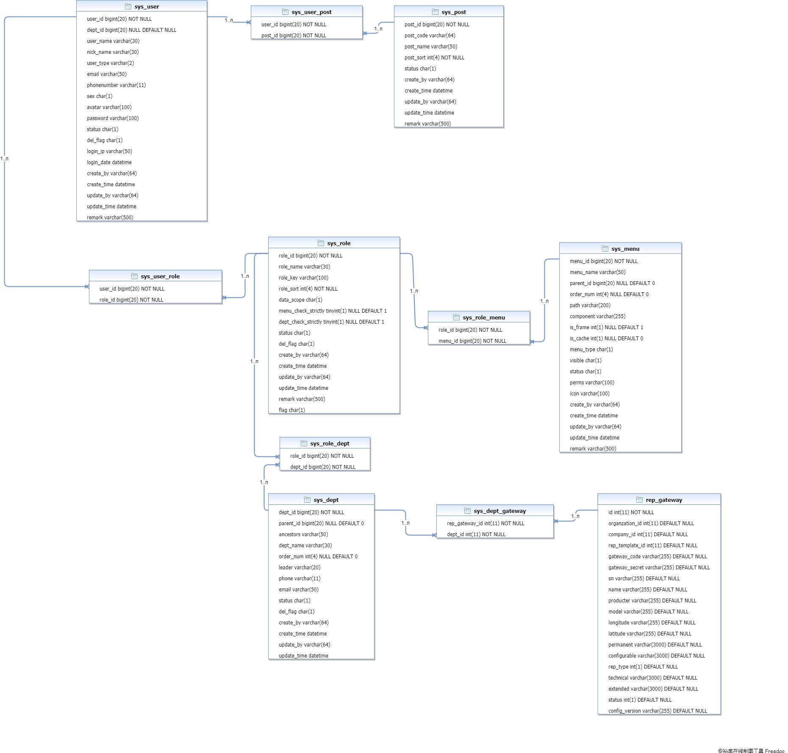

## ER02图（系统权限）
#### 1、ER02图整体概况

##表详细设计

#### 13、 sys_dept
部门表

| 序号 | 名称 | 描述 | 类型 | 键 | 为空 | 额外 | 默认值 |
| :--: | :--: | :--: | :--: | :--: | :--: | :--: | :--: |
| 1 | `dept_id` | 部门id | bigint(20) | PRI | NO | auto_increment |  |
| 2 | `parent_id` | 父部门id | bigint(20) |  | YES |  | 0 |
| 3 | `ancestors` | 祖级列表 | varchar(50) |  | YES |  |  |
| 4 | `dept_name` | 部门名称 | varchar(30) |  | YES |  |  |
| 5 | `order_num` | 显示顺序 | int(4) |  | YES |  | 0 |
| 6 | `leader` | 负责人 | varchar(20) |  | YES |  |  |
| 7 | `phone` | 联系电话 | varchar(11) |  | YES |  |  |
| 8 | `email` | 邮箱 | varchar(50) |  | YES |  |  |
| 9 | `status` | 部门状态（0正常 1停用） | char(1) |  | YES |  | 0 |
| 10 | `del_flag` | 删除标志（0代表存在 2代表删除） | char(1) |  | YES |  | 0 |
| 11 | `create_by` | 创建者 | varchar(64) |  | YES |  |  |
| 12 | `create_time` | 创建时间 | datetime |  | YES |  |  |
| 13 | `update_by` | 更新者 | varchar(64) |  | YES |  |  |
| 14 | `update_time` | 更新时间 | datetime |  | YES |  |  |

#### 14、 sys_dept_gateway
部门和物联网关关联表

| 序号 | 名称 | 描述 | 类型 | 键 | 为空 | 额外 | 默认值 |
| :--: | :--: | :--: | :--: | :--: | :--: | :--: | :--: |
| 1 | `rep_gateway_id` | 物联网关ID | int(11) | PRI | NO |  |  |
| 2 | `dept_id` | 部门ID | int(11) | PRI | NO |  |  |

#### 15、 sys_menu
菜单权限表

| 序号 | 名称 | 描述 | 类型 | 键 | 为空 | 额外 | 默认值 |
| :--: | :--: | :--: | :--: | :--: | :--: | :--: | :--: |
| 1 | `menu_id` | 菜单ID | bigint(20) | PRI | NO | auto_increment |  |
| 2 | `menu_name` | 菜单名称 | varchar(50) |  | NO |  |  |
| 3 | `parent_id` | 父菜单ID | bigint(20) |  | YES |  | 0 |
| 4 | `order_num` | 显示顺序 | int(4) |  | YES |  | 0 |
| 5 | `path` | 路由地址 | varchar(200) |  | YES |  |  |
| 6 | `component` | 组件路径 | varchar(255) |  | YES |  |  |
| 7 | `is_frame` | 是否为外链（0是 1否） | int(1) |  | YES |  | 1 |
| 8 | `is_cache` | 是否缓存（0缓存 1不缓存） | int(1) |  | YES |  | 0 |
| 9 | `menu_type` | 菜单类型（M目录 C菜单 F按钮） | char(1) |  | YES |  |  |
| 10 | `visible` | 菜单状态（0显示 1隐藏） | char(1) |  | YES |  | 0 |
| 11 | `status` | 菜单状态（0正常 1停用） | char(1) |  | YES |  | 0 |
| 12 | `perms` | 权限标识 | varchar(100) |  | YES |  |  |
| 13 | `icon` | 菜单图标 | varchar(100) |  | YES |  | # |
| 14 | `create_by` | 创建者 | varchar(64) |  | YES |  |  |
| 15 | `create_time` | 创建时间 | datetime |  | YES |  |  |
| 16 | `update_by` | 更新者 | varchar(64) |  | YES |  |  |
| 17 | `update_time` | 更新时间 | datetime |  | YES |  |  |
| 18 | `remark` | 备注 | varchar(500) |  | YES |  |  |

#### 16、 sys_post
岗位信息表

| 序号 | 名称 | 描述 | 类型 | 键 | 为空 | 额外 | 默认值 |
| :--: | :--: | :--: | :--: | :--: | :--: | :--: | :--: |
| 1 | `post_id` | 岗位ID | bigint(20) | PRI | NO | auto_increment |  |
| 2 | `post_code` | 岗位编码 | varchar(64) |  | NO |  |  |
| 3 | `post_name` | 岗位名称 | varchar(50) |  | NO |  |  |
| 4 | `post_sort` | 显示顺序 | int(4) |  | NO |  |  |
| 5 | `status` | 状态（0正常 1停用） | char(1) |  | NO |  |  |
| 6 | `create_by` | 创建者 | varchar(64) |  | YES |  |  |
| 7 | `create_time` | 创建时间 | datetime |  | YES |  |  |
| 8 | `update_by` | 更新者 | varchar(64) |  | YES |  |  |
| 9 | `update_time` | 更新时间 | datetime |  | YES |  |  |
| 10 | `remark` | 备注 | varchar(500) |  | YES |  |  |

#### 17、 sys_role
角色信息表

| 序号 | 名称 | 描述 | 类型 | 键 | 为空 | 额外 | 默认值 |
| :--: | :--: | :--: | :--: | :--: | :--: | :--: | :--: |
| 1 | `role_id` | 角色ID | bigint(20) | PRI | NO | auto_increment |  |
| 2 | `role_name` | 角色名称 | varchar(30) |  | NO |  |  |
| 3 | `role_key` | 角色权限字符串 | varchar(100) |  | NO |  |  |
| 4 | `role_sort` | 显示顺序 | int(4) |  | NO |  |  |
| 5 | `data_scope` | 数据范围（1：全部数据权限 2：自定数据权限 3：本部门数据权限 4：本部门及以下数据权限） | char(1) |  | YES |  | 1 |
| 6 | `menu_check_strictly` | 菜单树选择项是否关联显示 | tinyint(1) |  | YES |  | 1 |
| 7 | `dept_check_strictly` | 部门树选择项是否关联显示 | tinyint(1) |  | YES |  | 1 |
| 8 | `status` | 角色状态（0正常 1停用） | char(1) |  | NO |  |  |
| 9 | `del_flag` | 删除标志（0代表存在 2代表删除） | char(1) |  | YES |  | 0 |
| 10 | `create_by` | 创建者 | varchar(64) |  | YES |  |  |
| 11 | `create_time` | 创建时间 | datetime |  | YES |  |  |
| 12 | `update_by` | 更新者 | varchar(64) |  | YES |  |  |
| 13 | `update_time` | 更新时间 | datetime |  | YES |  |  |
| 14 | `remark` | 备注 | varchar(500) |  | YES |  |  |
| 15 | `flag` |  | char(1) |  | YES |  |  |

#### 18、 sys_role_dept
角色和部门关联表

| 序号 | 名称 | 描述 | 类型 | 键 | 为空 | 额外 | 默认值 |
| :--: | :--: | :--: | :--: | :--: | :--: | :--: | :--: |
| 1 | `role_id` | 角色ID | bigint(20) | PRI | NO |  |  |
| 2 | `dept_id` | 部门ID | bigint(20) | PRI | NO |  |  |

#### 19、 sys_role_menu
角色和菜单关联表

| 序号 | 名称 | 描述 | 类型 | 键 | 为空 | 额外 | 默认值 |
| :--: | :--: | :--: | :--: | :--: | :--: | :--: | :--: |
| 1 | `role_id` | 角色ID | bigint(20) | PRI | NO |  |  |
| 2 | `menu_id` | 菜单ID | bigint(20) | PRI | NO |  |  |

#### 20、 sys_user
用户信息表

| 序号 | 名称 | 描述 | 类型 | 键 | 为空 | 额外 | 默认值 |
| :--: | :--: | :--: | :--: | :--: | :--: | :--: | :--: |
| 1 | `user_id` | 用户ID | bigint(20) | PRI | NO | auto_increment |  |
| 2 | `dept_id` | 部门ID | bigint(20) |  | YES |  |  |
| 3 | `user_name` | 用户账号 | varchar(30) |  | NO |  |  |
| 4 | `nick_name` | 用户昵称 | varchar(30) |  | NO |  |  |
| 5 | `user_type` | 用户类型（00系统用户） | varchar(2) |  | YES |  | 00 |
| 6 | `email` | 用户邮箱 | varchar(50) |  | YES |  |  |
| 7 | `phonenumber` | 手机号码 | varchar(11) |  | YES |  |  |
| 8 | `sex` | 用户性别（0男 1女 2未知） | char(1) |  | YES |  | 0 |
| 9 | `avatar` | 头像地址 | varchar(100) |  | YES |  |  |
| 10 | `password` | 密码 | varchar(100) |  | YES |  |  |
| 11 | `status` | 帐号状态（0正常 1停用） | char(1) |  | YES |  | 0 |
| 12 | `del_flag` | 删除标志（0代表存在 2代表删除） | char(1) |  | YES |  | 0 |
| 13 | `login_ip` | 最后登录IP | varchar(50) |  | YES |  |  |
| 14 | `login_date` | 最后登录时间 | datetime |  | YES |  |  |
| 15 | `create_by` | 创建者 | varchar(64) |  | YES |  |  |
| 16 | `create_time` | 创建时间 | datetime |  | YES |  |  |
| 17 | `update_by` | 更新者 | varchar(64) |  | YES |  |  |
| 18 | `update_time` | 更新时间 | datetime |  | YES |  |  |
| 19 | `remark` | 备注 | varchar(500) |  | YES |  |  |

#### 21、 sys_user_post
用户与岗位关联表

| 序号 | 名称 | 描述 | 类型 | 键 | 为空 | 额外 | 默认值 |
| :--: | :--: | :--: | :--: | :--: | :--: | :--: | :--: |
| 1 | `user_id` | 用户ID | bigint(20) | PRI | NO |  |  |
| 2 | `post_id` | 岗位ID | bigint(20) | PRI | NO |  |  |

#### 22、 sys_user_role
用户和角色关联表

| 序号 | 名称 | 描述 | 类型 | 键 | 为空 | 额外 | 默认值 |
| :--: | :--: | :--: | :--: | :--: | :--: | :--: | :--: |
| 1 | `user_id` | 用户ID | bigint(20) | PRI | NO |  |  |
| 2 | `role_id` | 角色ID | bigint(20) | PRI | NO |  |  |

